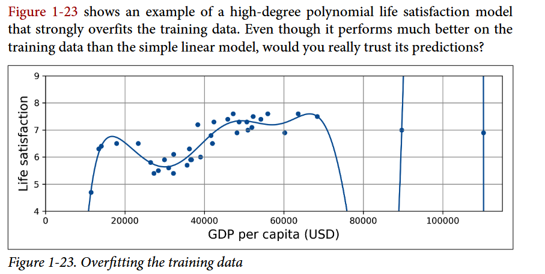

Source from _Aurélien Géron - Hands-On Machine Learning with Scikit-Learn, Keras, and TensorFlow Concepts, Tools, and Techniques to Build Intelligent Systems (2022, O'Reilly Media) - libgen.li (1).pdf_
# CHAPTER 01: THE MACHINE LEARNING LANDSCAPE
# Supervised
Training set you feed to the algorithm includes the desired solutions, called labels
Some regression models can be used for classification as well
For example: *Logistic regression*
# Unsupervised
Training data is unlabeled. The system tries to learn without a teacher
_Visualization_ algorithms are also good examples of *unsupervised* learning to understand how the data is organized and identify unsuspected patterns.

_Dimensionality reduction_, in which the goal is to simplify the data whithout losing too much information

For example: A car's mileage may be strongly correlated with its age, so the dimensionality reduction algorithm will merge them into one feature that represents the car's wear and tear -> _feature extraction_

_Anomaly detection_, _novelty detection_, _association rule learning_ (dig into large amounts of data and discover relations between attributes)

# Semi-supervised
Labeling data is usually time-consuming and costly, you will often have plenty of unlabeled instances. This approach here is called [Semi-supervised]
Most semi-supervised learning algorithms are combinations of [Unsupervised] and [Supervised]

# Self-supervised
Generating a fully labeled dataset from a fully unlabeled one
Then the whole dataset is labeled and any [Supervised] learning algorithm can be used.

# Reinforcement learning
The learning system, called an _agent_
Get _rewards_ in return (or _penalties_ in the form of negative rewards)

# Summary
- You studied the data
- You selected a model
- You trained on the training data
- Finally, applied the model to make predictions on new cases (this is called inference), hoping that this model will generalize well.

[ The Unreasonable Effectiveness of Data”, IEEE Intelligent Systems 24 ](https://github.com/florian/reading-notes/blob/master/papers/001_The_Unreasonable_Effectiveness_of_Data.md)

---

# Poor-Quality Data

Training data is full of errors, outliers, and noise this will make it harder for the system to detect the underlying patterns -> less likely to perform well
_Most_ data scientists spend a significant part of their time doing clean up training data

- If some instances are clearly outliers, discard them of try to fix
- If missing a few features -> ignore this attribute, fill in missing values or train one model with the feature and one model without it.

# Overfitting the Training Data

When the model performs well on the training data, but it does not generalize well 

It happens when the model is too complex relative to the amount and noisiness of the training data
* Possible solution
    * Gather more training data
    * Reduce the noise in the training data (e.g., fix data errors or remove outliers)
    * Reducing the number of attributes in the training data, or by constraining model
        * A model like it also call _regularization_
        * The amount of regularization to apply during learning can be controlled by a hyper-parameter
        [Example](./images/regulaziration_model.png)
# Underfitting
* Opposite of overfitting
* It occurs when your model is too simple to learn the underlying structure of the data.
* Possible solution
    * Select a more powerfull model, with more parameters
    * Feed better features
    * Reduce the constraints on the model
