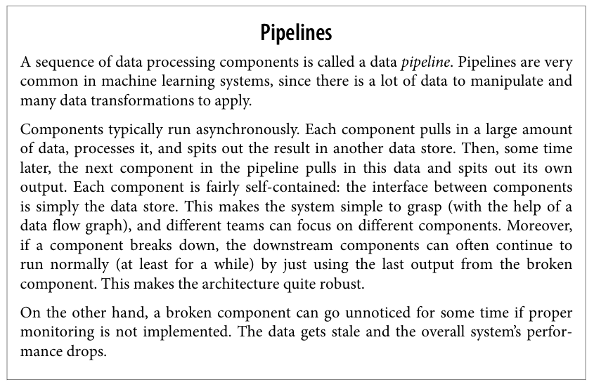

# CHAPTER2 END-TO-END [ML PROJECT]
## Main steps
1. Look at the big picture.
2. Get the data.
3. Explore and visualize the data to gain insights.
4. Prepare the data for machine learning algorithms.
5. Select a model and train it.
6. Fine-tune your model.
7. Present your solution.
8. Launch, monitor, and maintain your system

---

---

* Determine what kind of training supervision the model will need.
    * Is it a classification task, a regression task, ...
    * Should we use batch learning or online learning techniques?

---

**Typical performance measure for regression problems is**
    
    * root mean square error (RMSE)
    * Meanings:
        * Accurately assess the accuracy of a regression model
        * The smallest RMSE the highest the accuracy regression model
    * mean absolute error - average absolute deviation
$\text{RMSE}(\mathbf{X}, h) = \sqrt{\frac{1}{m} \sum_{i=1}^{m} \left(h(\mathbf{x}^{(i)}) - y^{(i)}\right)^2}$

* _m_ is the number of instances in dataset you are mearsuring the RMSE on
* $\mathbf(x)^{(i)}$ is a vector of all the feature values of the 
$i^{th}$ instance in the dataset, and $y^{(i)}$ is its label
* $\mathbf{X}$ is a matrix containing all the feature values (excluding labels) of all instances in the dataset.
* _h_ is system's prediction function, also called a _hypothesis_.

$\text{MAE}(\mathbf{X},h) = \frac{1}{m} \sum_{i=1}^{m}|h(\mathbf{x}^{(i)}-y^{(i)})|$
