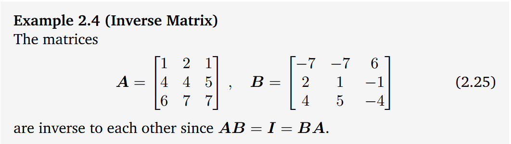
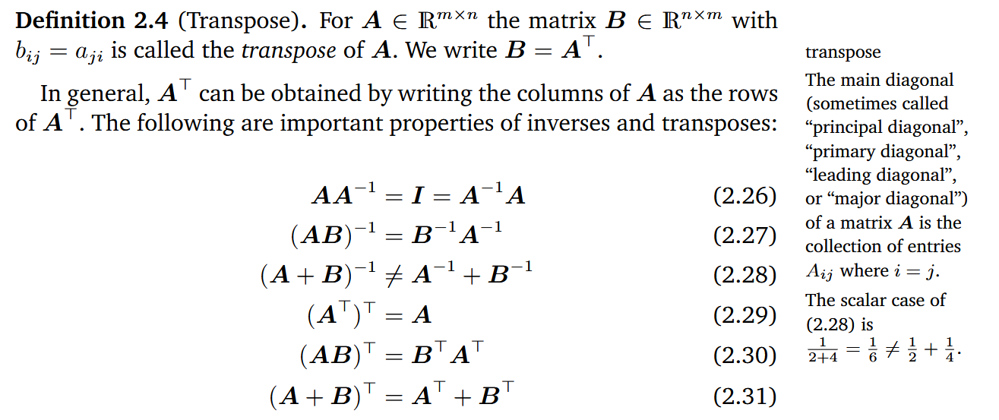
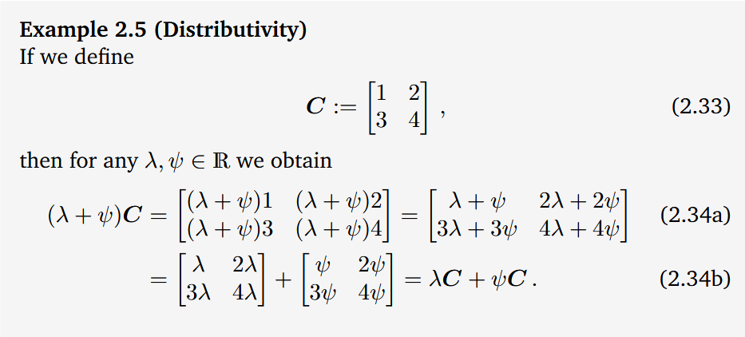

[DATE 04-06-2025] *FORMAT MM-dd-YYYY*
# Mathematical foundations
## System of linear equations:
- **has no solution**: ...,
- **unique solution**: ...,
- **free variable**: infinitely many solutions,
- **systematic approach**: solving systems of linear equations,
## Matrices:
- **vector**:as numerical data,
- **matrix**:as table of such data (vectors),
- **addition**: ...,
- **multiplication**: ...,
- **properties**:
    - **associativety**: ...,
    - **distributivity**: ...,
    - **multiplication with the identify matrix**: ...,
- **inverse matrix**: 
    - 
- **transpose**
    - 
- **symmetric**
    - Only (n, n)-matrices can be symmetric
    - The sum of symmetric is always symmetric
        - However, although their product is always defined, it is generally not symmetric
- **multiplication by a scalar** : 
- **Compact representation of [[System of linear equations]]**
$$
\begin{bmatrix}
2 & 3 & 5 \\
4 & -2 & -7\\
9 & 5 & -3
\end{bmatrix}
\begin{bmatrix}
x_1 \\
x_2 \\
x_3
\end{bmatrix}
=
\begin{bmatrix}
1 \\
8 \\
2
\end{bmatrix}
$$

